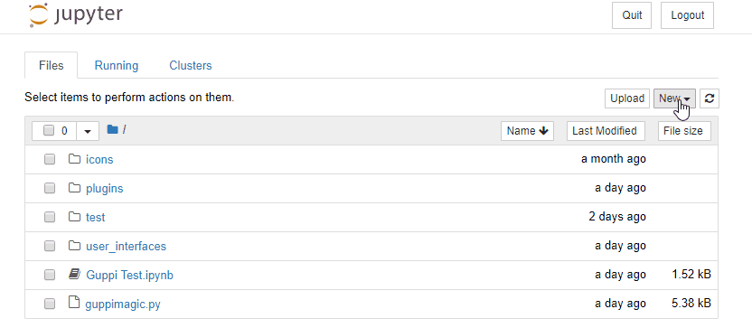
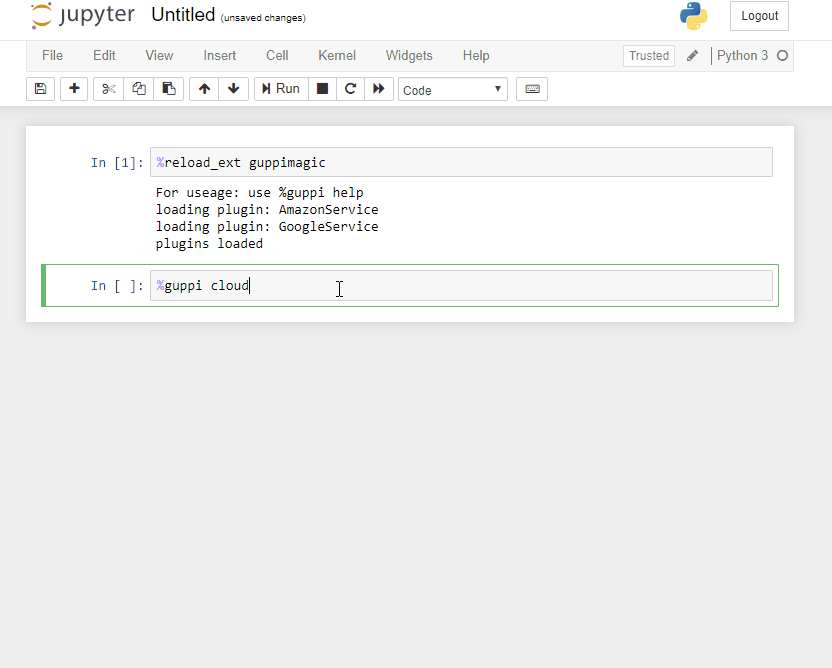

<p align="center">
  
</p>

# Project GUPPI

A unified platform for data scientists to easily access all the services they need within Jupyter Notebook.

## Getting Started

These instructions will get you a copy of the project up and running on your local machine.

### Prerequisites
Ensure the following are installed on your machine:

* [Python (3.3 or greater, or Python 2.7)](https://www.python.org/downloads/)

* [git](https://git-scm.com/downloads)

* [Jupyter Notebook](https://jupyter.org/install)

### Installation


#### Clone project guppi

```
git clone https://github.com/katekaho/project-guppi.git
```

#### Move into guppi directory

```
cd project-guppi
```
#### Pip install the required Python packages

```
pip install -r setup/req.txt
```

#### Open Jupyter Notebook

```
Jupyter Notebook
```

#### Create a new Python3 notebook


#### Load our GUPPI extension by typing the following iPython magic command into a cell and running it
```
%reload_ext guppimagic
```

#### Follow the configuration instructions for the cloud services.
Once everything is properly configured, you'll be able to view and run commands on your cloud instances 🎉




## Contributing

Please read [CONTRIBUTING.md](https://gist.github.com/PurpleBooth/b24679402957c63ec426) for details on our code of conduct, and the process for submitting pull requests to us.

## Authors

* **Joseph Aronson** - *Initial work* - [joeyaronson](https://github.com/joeyaronson)
* **Japheth Frolick** - *Initial work* - [japhyf](https://github.com/japhyf)
* **Kate Miller** - *Initial work* - [katekaho](https://github.com/katekaho)

See also the list of [contributors](https://github.com/your/project/contributors) who participated in this project.

## License

This project is licensed under ? - see the [LICENSE.md](LICENSE.md) file for details

## Acknowledgments

Cisco Security Business Group
* Subharthi Paul
* Nancy Cam-Winget
* Oleg Bessonov
* Saman Taghavi Zargar

Jack Baskin School of Engineering Staff
* Richard Jullig
* Patrick Mantey
* Reihaneh TorkzadehMahani 
* Morteza Behrooz
